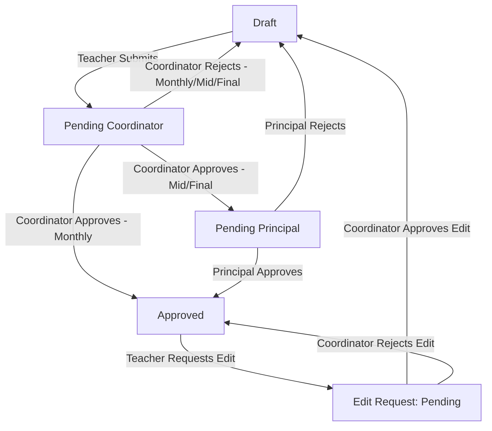

# Result Module: Complete Workflow Flowchart & Details (Roman Urdu)

SMS project ka **Result Module** ek multi-tier approval aur automated grading system par mabni hai. Isme Teachers, Coordinators aur Principals ke darmiyan dynamic transitions aur checks lagaye gaye hain.

Niche iska complete flow detail mein bataya gaya hai:

---

## 1. Roles aur unki Responsibilities (Kirdar)

*   **Teacher (Ustad):**
    *   Results ko manually create/edit karte hain ya Excel templates ke zariye bulk upload karte hain.
    *   Dafatan save karne par result **Draft** status mein rehta hai.
    *   Result mukammal hone par use Coordinator ko submit (`pending_coordinator`) karte hain.
    *   Agar koi approved result edit karna ho, to Coordinator se **Edit Request** ke zariye permission mangte hain.
*   **Coordinator:**
    *   Classroom results ko review karte hain.
    *   **Monthly Tests** ko khud approve (`approved`) ya reject (`draft`) kar sakte hain.
    *   **Mid Term & Final Term** results ko verify kar ke Principal ko forward (`pending_principal`) karte hain.
    *   Teachers ki edit requests ko approve/reject karte hain.
*   **Principal:**
    *   Sirf **Mid Term aur Final Term** results ko final approval (`approved`) ya reject (`draft`) karte hain.
    *   Final Term result approve hone par students ki automated promotion trigger hoti hai.
*   **Student (Taleb-e-ilm):**
    *   Sirf **Approved** results ko Student Portal par dekh sakte hain.

---

## 2. Result Status Lifecycle (Result Ki Halat)

Ek result lifecycle ke dauran in statuses se guzarta hai:

---

## 3. Step-by-Step Flow (Marhala-war Flow)

### Step 1: Result Creation & Calculation (Draft)
1. **Result Entry:** Teacher student ka exam record banata hai.
2. **Midterm Requirement check for Final:** Agar Teacher `final` term result create karne lagta hai, to system check karta hai ke kya student ka `midterm` result pehle se approved hai ya nahi. Agar midterm approved nahi hoga, to final term result create nahi karne diya jayega.
3. **Marks Calculation:** System automatic calculation perform karta hai (`calculate_totals` method):
    *   **Behavior subjects** (jaise: `behaviour`, `homework`, `hygiene`, `observation`, `participation`, `respect`, etc.) ko overall percentage aur totals se exclude kiya jata hai.
    *   **Passing Thresholds:**
        *   **Mid Term:** Passing marks **33%** hain. (33% se 39% tak wale student ko grade **E** milta hai).
        *   **Monthly & Final Term:** Passing marks **40%** hain. (Koi E grade nahi hota, 40% se neeche direct **F** grade hota hai).
    *   **Absence Rule:** Agar student pure exam mein absent (`is_absent=True`) hai, to obtained marks 0 ho jate hain, grade **Absent** aur status **absent** ho jata hai.
    *   **Overall Pass/Fail:** Student tabhi pass hota hai jab wo saare non-behavior subjects mein pass ho, overall percentage threshold ko meet kare, aur kisi subject mein absent na ho.

### Step 2: Submission (Pending Coordinator)
1. Teacher individual result submit karta hai (`<pk>/submit/`) ya phir pure class ka result bulk mein forward karta hai (`forward-class/`).
2. Result ka status `pending_coordinator` ho jata hai aur coordinator ko notification chali jati hai.

### Step 3: Coordinator Review
*   **Monthly Test:**
    *   Coordinator isko direct **Approve** kar sakta hai (Status -> `approved`, digital signature attach ho jati hai aur student/teacher dono ko notification chali jati hai).
    *   Ya phir **Reject** kar sakta hai (Status wapas -> `draft` ho jata hai aur comments add ho jate hain taake teacher correction kar sake).
*   **Mid / Final Term:**
    *   Coordinator isko review kar ke **Forward/Approve** karta hai, jis se status `pending_principal` ban jata hai aur Principal ko alert chala jata hai.

### Step 4: Principal Review (Sirf Mid aur Final ke liye)
*   Principal result ko review karta hai:
    *   **Approve:** Status `approved` ho jata hai, digital signature lag jati hai, aur notification trigger ho jati hai.
    *   **Reject:** Status wapas `draft` ho jata hai, comments ke sath.

---

## 4. Automated Student Promotion Workflow (Final Term Approval par)

Jab Principal kisi student ka **Final Term** result **Approve** karta hai, to niche diya gaya promotion system chalta hai:

1. **Staging Area (Section E):**
    *   Agar student saare subjects mein **Pass** ho jata hai aur overall status `pass` hai, to use temporary staging area **Section E** mein bhej diya jata hai (`_move_student_to_section_e`).
    *   Student ki classroom history save ki jati hai (`last_class_passed`, `last_class_teacher`).
    *   Student ko uske current grade ke **Section E** mein transfer kar diya jata hai (e.g., Grade 1 Section A se Grade 1 Section E).
    *   Student aur parent dono ko promotion ki notification chali jati hai.
2. **Failed/Absent Students:**
    *   Inhe promote nahi kiya jata. Ye usi class mein rehte hain. Inke liye bhi parent aur student ko notification jati hai.
3. **Final Promotion (Next Grade):**
    *   Baad mein, Admin ya Coordinator `/api/result/promote-students/` endpoint ke zariye in Section E wale students ko select kar ke bulk mein target classroom (next grade, jaise Grade 2 Section A) mein promote kar dete hain.

---

## 5. Result Edit Request Workflow (Approved Result ko Unlock karna)

Ek baar result `approved` ho jaye, to wo lock ho jata hai aur teacher use directly edit nahi kar sakta. Wapas edit karne ka flow ye hai:

1. **Request Submission:** Teacher result par **Edit Request** submit karta hai ek solid reason ke sath (`ResultEditRequest`).
2. **Notification:** Coordinator ko notification jati hai.
3. **Coordinator Decision:**
    *   **Approve:** Status `draft` par chala jata hai aur edit count reset ho jata hai, jis se teacher dobara result update kar sakta hai.
    *   **Reject:** Result approved hi rehta hai, aur reject reason ke sath teacher ko notification chali jati hai.

---

## 6. Retest Integration (Wapas Imtihan)

Agar student fail ho jata hai, to wo **Retest** de sakta hai:
*   Student portal par final result calculate karte waqt, agar kisi subject ka **Retest Result** (`status='approved'`) maujood ho, to system original failed marks ki jagah retest wale marks ko display karta hai.
